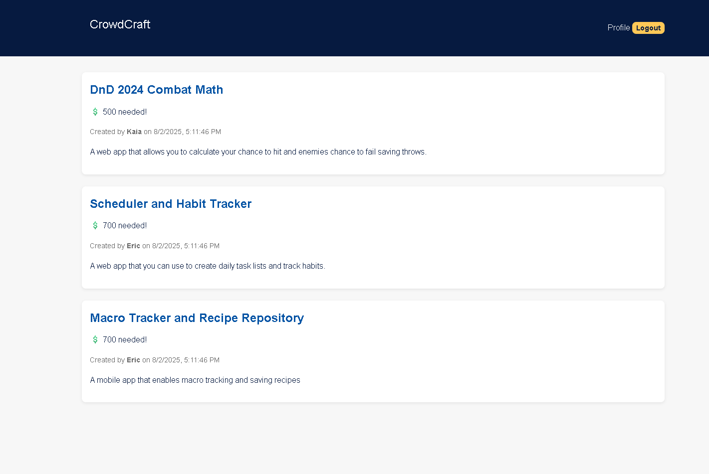

# CrowdCraft

## Description

CrowdCraft is a web application allowing users to create accounts and projects to be funded. Projects can be deleted by the user who created them or contributed to by anyone.

GitHub Repo, Website, and Preview Image:

[GitHub Repo](https://github.com/edrezner/crowdfund-app)

[Website](https://shielded-hollows-24695-c35d1dd6cf76.herokuapp.com/)

## Table of Contents

- [Usage](#usage)
- [License](#license)

## Usage

Create an account with an email/password. Validation will ensure an appropriate email and password is inputted.

All projects are shown on the landing page. A user's created projects are shown on their profile page. A new project can be created or a current project can be deleted.

All users whether logged in or not can contribute to any project.

## License

MIT
